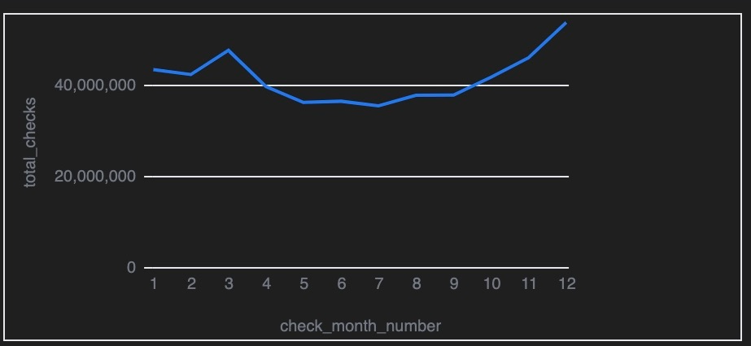
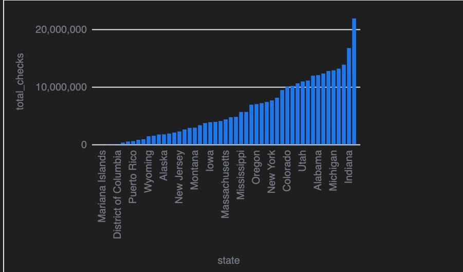
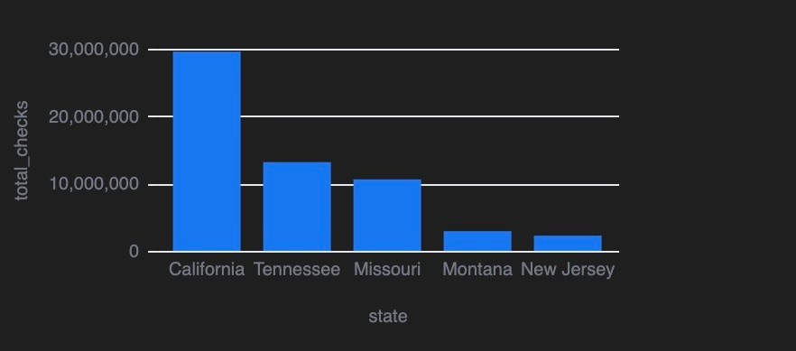

# FBI NICS Firearms Background Checks Dataset
This repository contains data on **firearm background checks** conducted across the United States. The dataset includes state-level firearm transactions, categorized by differenct firearm types, purchase methods, and administrative processes.
# FBI NICS Firearm Background Check Data

The data in this repository comes from the [FBI's National Instant Criminal Background Check System](https://www.fbi.gov/about-us/cjis/nics).

## Dataset Overview
This dataset provides insights into:
- **Trends** in firearm background checks over time
- **State-by-State firearm purchases and returns**
- **Handgun vs. Long gun transactions**
- **Private Sales, rentals, and pawn shop transactions**
- **Returned, rejected, and redemptive firearm transactions**

## Notes on the Dataset
Sales estimates are calculated from handgun, long gun and multiple-gun background checks. Permit checks and other categories of background checks are excluded. In California, multiple-gun checks were excluded because data was inconsistent. Because state laws differ, sales levels between states cannot be directly compared.

## Data Structure
The dataset contains the following columns:
| Column Name             | Description|
| `admin`                 | Administrative checks related to firearm transactions |
| `check_date`            | Full date of background check (YYYY-MM-DD) |
| `check_month`           | Month name of background check (e.g., "January") |
| `check_month_number`    | Month number (1-12) of background check |
| `handgun`               | Number of background checks for **handguns** |
| `long_gun`              | Number of background checks for **long guns (rifles/shotguns)** |
| `multiple`              | Number of transactions involving **multiple firearms** |
| `other`                 | Background checks classified under "other" |
| `permit`                | Number of background checks for **firearm permits** |
| `permit_recheck`        | Number of permit **rechecks** (e.g., for renewal or verification) |
| `perpawn_handgun`       | Pawned **handgun** transactions |
| `prepawn_long_gun`      | Pawned **long gun** transactions |
| `prepawn_other`         | Other types of **pawned** firearm transactions |
| `private_sale_handgun`  | Private sales of **handguns** |
| `private_sale_long_gun` | Private sales of **long guns** |
| `redemption_handgun`    | Redeemed **handguns** (previously pawned/sold) |
| `redemption_long_gun`   | Redeemed **long guns** (previously pawned/sold) |
| `redemption_other`      | Other types of **redeemed** firearms |
| `rentals_handgun`       | Rented **handguns** |
| `rentals_long_gun`      | Rented **long guns** |
| `return_to_seller_handgun` | **Handguns returned** to the seller |
| `return_to_seller_long_gun` | **Long guns returned** to the seller |
| `return_to_seller_other` | Other **firearm returns** to the seller |
| `returned_handgun`      | **Handguns returned** after purchase |
| `returned_long_gun`     | **Long guns returned** after purchase |
| `returned_other`        | Other **returned** firearms |
| `state`                 | **U.S. state** where the background check was conducted |
| `totals`                | **Total number of background checks** per record |

Visualizations and Insights

## Usage
This dataset can be used for:
- **Analyzing trends** in firearm background checks across states and time periods
- **Comparing gun sales reguilations** between sales
- **Visualizing firearm purchases** using data analytics tools like Malloy

## How to Use
To allow this file to properly run make sure open the documents within VSCode and you have download the following add-ons:
- Malloy extension
- Rainbow.csv

## Dataset Summary
From the analysis of this dataset, we discovered the following: 
1. **Background checks fluctuate seasonnally**, with **spikes around elections and major holidays.**
- December is the peak month for firearm background checks → Possibly due to holiday season sales, hunting season, and political concerns.
2. **Certain states dominate firearm trasnactions**, particularly **Texas, California, and Florida**
- Kentucky has the highest number of background checks → This may be influenced by state policies or a high gun ownership rate.
3. **Handgun sales outpace long guns in most states**, though **hunting states favor long guns**
- When filtering states with strong hunting cultures (Montana, Wyoming, Alaska, North Dakota, South Dakota), the data confirms that long guns are purchased more frequently than handguns in these areas.
4. **Private sales contirbute signifcantly**, especially in states with **less restrictive firearm laws**
- States like Mariana Islands and Virgin Islands have the fewest background checks, likely due to low population and strict firearm laws.
5. **Firearm returns and rejections are common**, especially for **handguns.**
- Handguns have higher return rates than long guns, likely due to background check denials or legal restrictions.
- Administrative processes, permit rechecks, and failed background checks contribute to firearm rejections.

## License
This dataset and accompanying code are released under the **MIT License**.
You are free to:
- Use, copy, modify, and distribute the data and code for any purpose.
- Share it freely with attribution.

**Disclaimer:** This dataset is provided "as is," without any warranties or guarantees. 
See the full [MIT License](LICENSE) for more details.